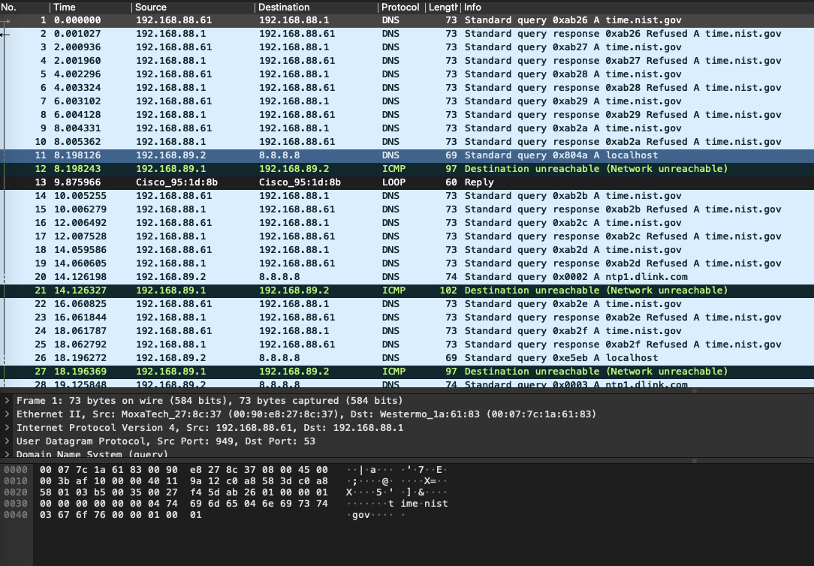
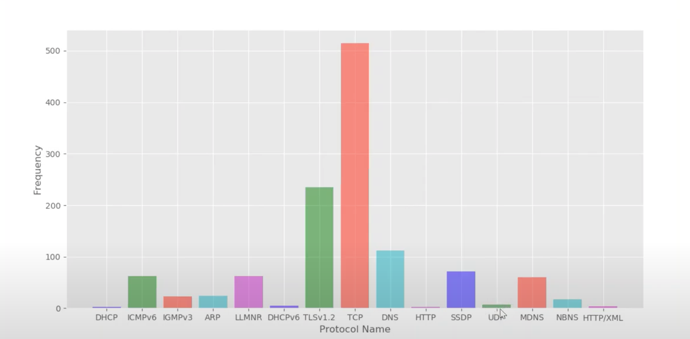
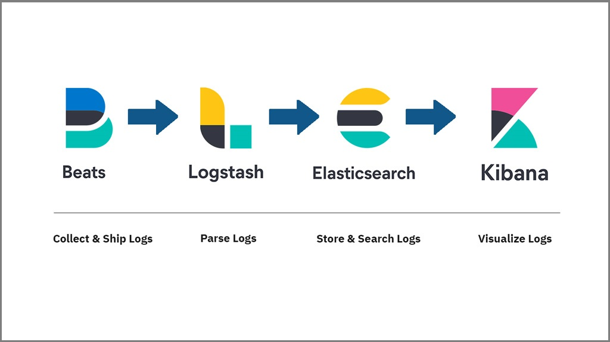
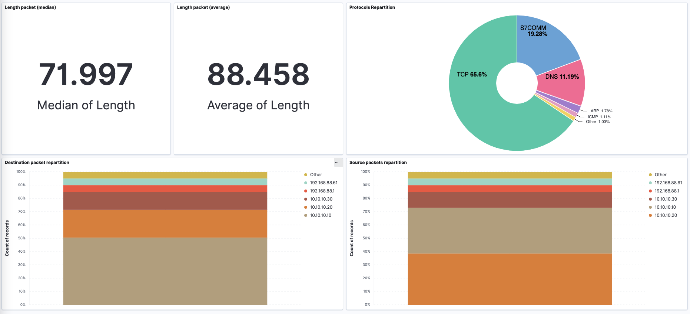

# ELK_Cybersecurite
ELK project, deploy stack and analyze pcap file (packet log security)

--------

## Introduction

SIEM (Security Information and Event Management) is a technical tool that will make it possible to manage the logs generated by the various equipment / applications (security or not) that make up a security system. information.
The objective of a SIEM is to allow security teams to detect attacks by exploiting, filtering and correlating these (millions) of logs from multiple sources of information ( internal or external to the organization).
SIEM is above all a centralized security supervision system. It is made up of two complementary solutions: SIM - Security Incident Management, which will focus on post-hoc analysis, archiving, compliance and reporting and SEM - Security. Event Management which seeks to collect and process data in near real time.
It seems more relevant to speak of the SIEM approach because the tool is only one brick of this security event management system. This approach must indeed also take into account the organizational, human and legal aspects that inevitably arise during a SIEM project.
Thus in the context of BigData and the proliferation of connected objects, the management of billions of application logs has become an issue both for managing the IS as well as for its protection.

How a SIEM works:

- The collection of events: passive or active with the implementation
agents directly on the various equipment or remotely.

- Standardization of events: conservation of raw logs for value
legal then saving these logs in an interpretable format.

- Storage and archiving of events according to their nature.

- Correlation of the information collected: implementation of rules of
correlation allowing alerting of an incident in progress and allowing
to identify the causes of a posteriori event.

- Reporting: generation of dashboards and reports to have
visibility into SIEM security and compliance.

So to better manage the centralization of security logs, new tools adapted to BigData have found their use like the ELK suite for Elastic -
Logstash - Kibana. This project therefore aims to propose a simple ELK architecture in order to be able to read network files: pcap (Packet Capture Data).

For this project, I will focus on the following pcap file (preview done with wireshark)

-----

## First approch 

A first idea is to use pyshark a python library. It allows parsing of packages using tshark wrappers in python. 

-----

## ELK Stack

- Beats : Installs on client machines, collects and sends logs to Logstash.
- Logstash : Processing of logs sent by beats (installed on client machines).
- Elasticsearch : Stores logs and events from Logstash and provides the ability to search logs in real time
- Kibana : Provides viewing of events and logs.

If we want to use a cluster of elastic, we must think about CAP: Consistency - Availability - Partition tolerance.

- Consistency : reading is guaranteed to return the most recent entry for a given customer.
- Availability : the non-failed node will return a reasonable response within a reasonable time (no error or waiting time)
- Partition tolerance : the system will continue to operate when network partitions occur.

You can find the YAML file used to deploy with docker all the stack and finally the result of my kibana dashboard below :

I also make it with Elastic Cloud on this free cluster : https://observability-deployment-bfccd3.kb.us-west1.gcp.cloud.es.io:9243/app/dashboards#/view/ed0cd490-d344-11eb-805a-cd4926de5481?embed=true&_g=(filters%3A!()%2CrefreshInterval%3A(pause%3A!t%2Cvalue%3A0)%2Ctime%3A(from%3Anow-30m%2Cto%3Anow))

But it's no longer available so you have the screenshot.

-----

## Ressources :

1. RunningtheElasticStackonDocker-https://www.elastic.co/guide/en/elastic- stack-get-started/current/get-started-docker.htmlrc G. Bellemare and Joelle Pineau (2018))
2. RunPacketBeatonDocker-https://www.elastic.co/guide/en/beats/packetbeat/current/running- on-docker.html
3. Dockerforbeginners-https://towardsdatascience.com/docker-for-absolute- beginners-what-is-docker-and-how-to-use-it-examples-3d3b11efd830

